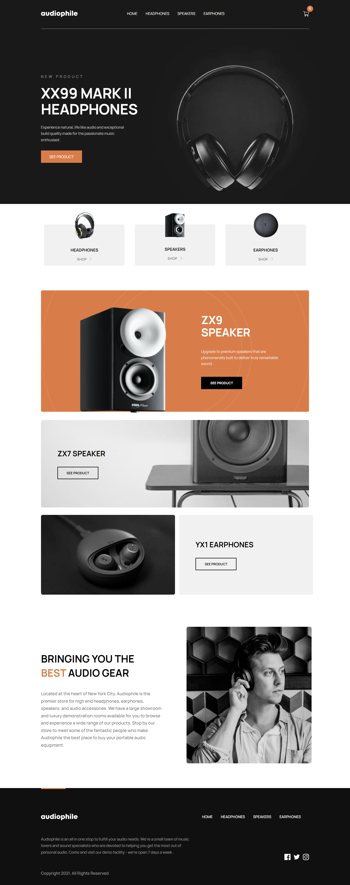

# Audiophile Ecommerce web-app

## The features

Users are be able to:

- View the optimal layout for the app depending on their device's screen size
- See hover states for all interactive elements on the page
- Add/Remove products from the cart
- Fill in all fields in the checkout
- Receive form validations if fields are missed or incorrect during checkout
- See correct checkout totals depending on the products in the cart
  - Shipping always adds $50 to the order
  - VAT is calculated as 20% of the product total, excluding shipping
- See an order confirmation modal after checking out with an order summary

## Screenshot


## Links
- Live Site URL: [https://audiophile11.netlify.app/](https://audiophile11.netlify.app/)

## Built with
- CSS custom properties
- Flexbox
- CSS Grid
- Mobile-first workflow
- [Vuejs](https://vuejs.org/) - JS library
- [Vue router](https://router.vuejs.org/) - Vuejs library
- [VueX](https://vuex.vuejs.org/) - Vuejs library

## Project setup
```
npm install
```

### Compiles and hot-reloads for development
```
npm run serve
```

### Compiles and minifies for production
```
npm run build
```

### Lints and fixes files
```
npm run lint
```

### Customize configuration
See [Configuration Reference](https://cli.vuejs.org/config/).
